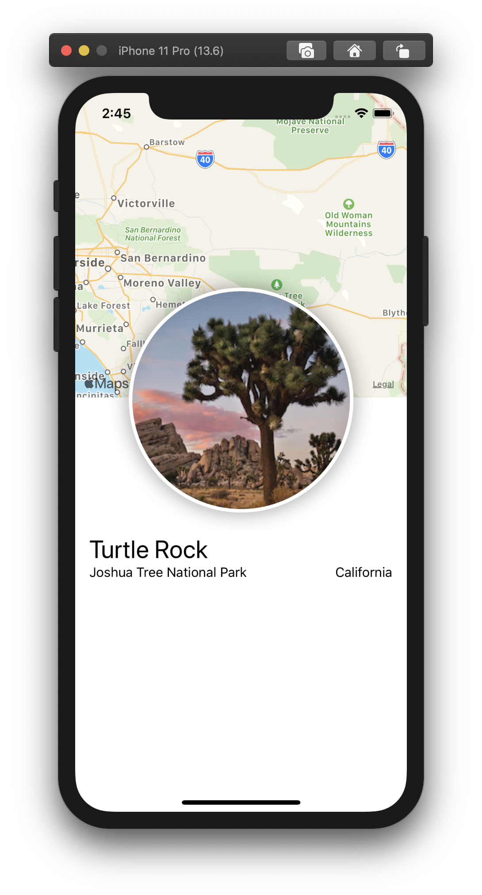
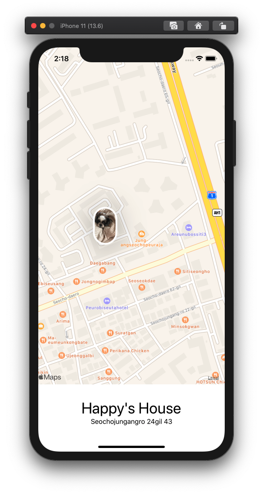
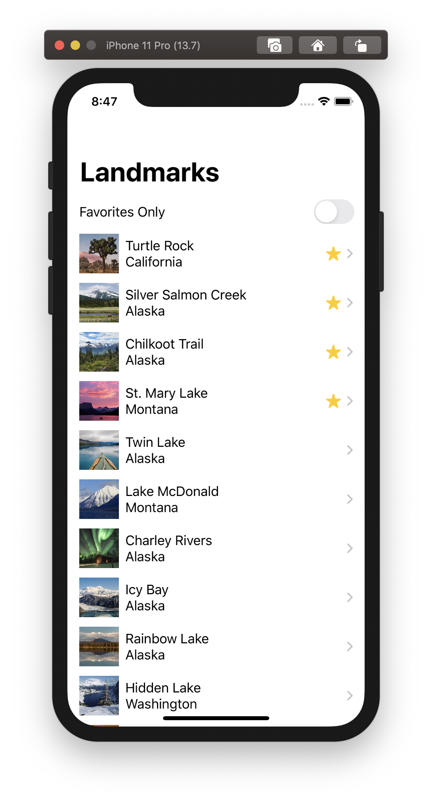

# SU Study

## 1주차(발표)

 

### 사용한 문법들

#### 1. VStack,HStack 
[HVStack](./subReadme/1st/HStackVStack.md)

#### 2. MapView
[MapView](./subReadme/1st/MapView.md)

#### 3. ImageView
[ImageView](./subReadme/1st/ImageView.md)

## 2주차 + 3주차

 
